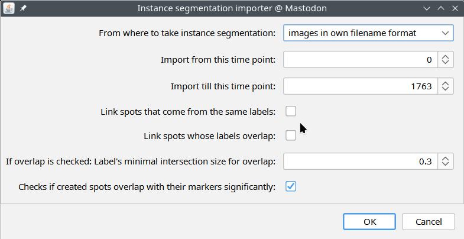
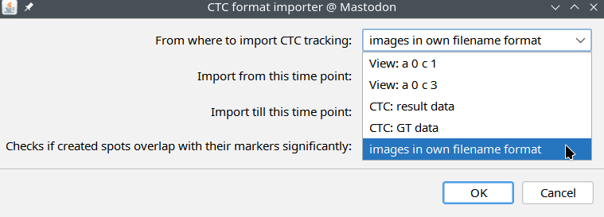
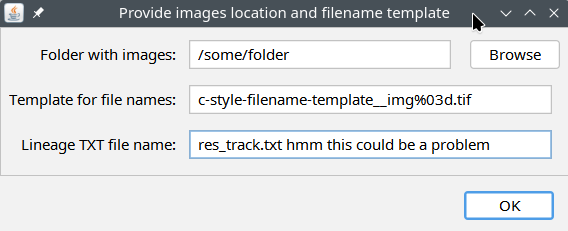

# The CellTrackingChallenge Mastodon Baseline
[...one can find here](https://github.com/CellTrackingChallenge/mastodon-ctc?tab=readme-ov-file#the-celltrackingchallenge-mastodon-baseline)

# Welcome
This is a repository with Java source codes of the [Fiji](http://fiji.sc) tools related to the [Cell Tracking Challenge](http://www.celltrackingchallenge.net)s
and to [Mastodon](https://github.com/mastodon-sc/mastodon).

The tools were developed and the page is maintained by [Vladimír Ulman](http://www.fi.muni.cz/~xulman/).

Enabling update site in a new or existing Fiji installation:
------------------------------------------------------------
1. Open Fiji
1. Click menus: 'Help' -> 'Update...'
1. Click 'Manage update sites' in the opened 'ImageJ Updater' dialog
1. Mark the 'Mastodon' and 'CellTrackingChallenge' checkboxes
1. Click 'Close' to close the dialog

License
--------
The tools are licensed with the [BSD 2-Clause License](https://choosealicense.com/licenses/bsd-2-clause/).

Notes
------
Once installed, one can find the tools in the Mastodon, in the _Plugins_ menu.
Contact (ulman při fi.muni.cz) for help on how to use it.

# Instance segmentation importers
## Generic segmentation-only importer
This importer was designed to extract spots from instance segmentation,
and on-demand create links between segments (spots) that overlap significantly
in consecutive time points.

One can find the dialog in Mastodon -> Plugins -> Imports -> Import from instance segmentation:

## CTC-formatted segmentation and tracking importer
This importer was designed to extract spots from instance segmentation,
and create links between segments (spots) of the same label.

One can find the dialog in Mastodon -> Plugins -> Cell Tracking Challenge -> Import from CTC format:

There, one could choose a folder and format of the filenames in that folder:

...the `res_track.txt` file is an auxiliary file that informs which instance label
existed in what time points range and, especially, provides the parental relationship
information. If one holds only a segmentation and not also the tracking, it should
also suffice to provide an empty `res_track.txt` file.
But this is not a supported mode of operation.

